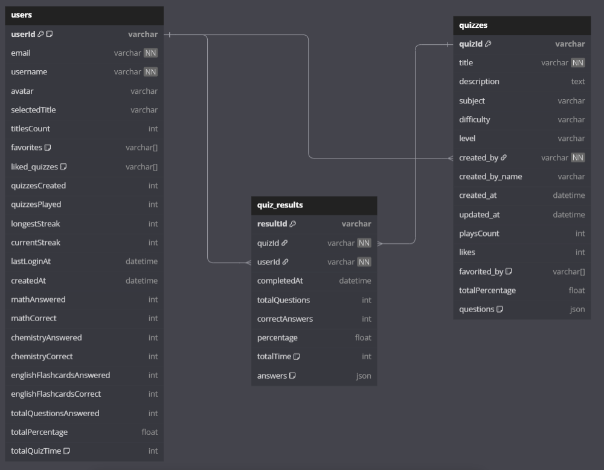

# **Dokumentacja aplikacji `Studino`**


## **Spis treści**

- **[Wprowadzenie](#wprowadzenie)**
   - [Cel aplikacji](#cel-aplikacji)
   - [Technologie](#technologie)
- [Szybki Start](#szybki-start)
- [Zależności projektu](#zależności-projektu)
- [Struktura katalogów](#struktura-katalogów)
- [Ekrany i funkcjonalności](#ekrany-i-funkcjonalności)
- [Właściwości aplikacji](#właściwości-aplikacji)
- [Styl i konwencje kodowania](#styl-i-konwencje-kodowania)
- [Zestaw kolorystyczny](#zestaw-kolorystyczny)
- [Architektura i wzorce projektowe](#architektura-i-wzorce-projektowe)
- [API i Integracje](#api-i-integracje)
- [Nawigacja i flow aplikacji](#nawigacja-i-flow-aplikacji)
- [UI](#ui)
- [Debugowanie i monitoring](#debugowanie-i-monitoring)<br><br>
- **[Baza Danych (Firebase Firestore)](#baza-danych-firebase-firestore)**
- [Wprowadzenie i cele](#wprowadzenie-i-cele)
- [Architektura bazy danych](#architektura-bazy-danych)
- [Schemat bazy (DDL)](#schemat-bazy-ddl)    
- [Słownik danych](#słownik-danych)
- [Relacje i spójność](#relacje-i-spójność)
- [Indeksy i optymalizacja](#indeksy-i-optymalizacja)
- [Widoki i procedury składowane](#widoki-i-procedury-składowane)
- [Bezpieczeństwo i uprawnienia](#bezpieczeństwo-i-uprawnienia)
- [Backup i odtwarzanie](#backup-i-odtwarzanie)
- [Przykładowe zapytania i raporty](#przykładowe-zapytania-i-raporty)

  
# Wprowadzenie

**Studino** to **aplikacja mobilna** napisana w **React Native**, umożliwiająca użytkownikom tworzenie własnych quizów, rozgrywanie quizów stworzonych przez innych, granie w **minigry edukacyjne** z zakresu chemii, matematyki i języka angielskiego, które wzmacniają umiejętności oraz zarządzanie profilem. Aplikacja umożliwia użytkownikom rejestrację/logowanie e-mail i hasło lub **Google Sign-In** i komunikuje się z **chmurą Firebase** (**Firestore** i **Firebase Authentication**) w celu przechowywania danych i uwierzytelniania.

## **Cel aplikacji**

Umożliwienie użytkownikom **łatwego tworzenia i rozgrywania quizów** oraz śledzenia ich wyników, również rozwijanie umiejętności poprzez **Minigry edukacyjne**.

## **Technologie**
Studino zostało napisane w **React Native** i wykorzystuje Firebase do autentykacji, Firestore Database, Storage. Do zarządzania stanem aplikacji wykorzystywane są **Hooki Reacta** oraz bezpośrednie zapytania do bazy **Firestore**. Do przechodzenia między ekranami wykorzystano bibliotekę React Navigation (Stack Navigator), a do wyglądu UI różne biblioteki m.in. `react-native-elements`, `react-native-modal`, `react-native-safe-area-context`.

# **Szybki Start**
Aby szybko rozpocząć pracę z projektem Studino, należy postępować według poniższych kroków:

1. **Wymagania wstępne**:
   - **Node.js** i **npm** lub **yarn** – do instalacji zależności i uruchamiania bundlera React Native.
   - **Android Studio** z **Android SDK** – do budowania wersji na Android.
   - **Urządzenie lub emulator**: Można użyć fizycznego telefonu, podłączonego przez kabel USB lub emulatora Androida do testów.
   - **Google CLI Android**: Aby testować logowanie Google na Androidzie, trzeba skonfiguruować SHA-1 w konsoli Firebase i wygenerować plik `google-services.json`.
2. Pobranie projektu:
   - Pobierz plik `.zip` i go wypakuj
   - Przejdź do folderu za pomocą:
     
     ```cd studino```
     
3. W katalogu głównym wykonaj

   ```
   npm install
   ```

   lub

   ```
   yarn install
   ```

5. Uruchomienie aplikacji:

   ```
   npm run android
   ```

# Zależności projektu

Projekt wykorzystuje wiele bibliotek z **React Native**. Poniżej znajduje się lista głównych zależności (`dependencies` z `package.json`) wraz z krótkim opisem ich roli:

- **@react-native-firebase/app/auth/firestore/storage**: Pakiety Firebase służące do integracji z usługami Google Firebase.
  - `app` – inicjalizacja i konfiguracja Firebase.
  - `auth` – obsługa uwierzytelniania (logowanie, rejestracja użytkownika).
  - `firestore` – interakcje z bazą danych Firestore (kolekcje i dokumenty quizów, użytkowników, wyników).
  - `storage` – (opcjonalnie) przechowywanie plików (np. zdjęć), w projekcie wstępnie skonfigurowane.
 
- **@react-navigation/native**, **@react-navigation/stack**: Biblioteki nawigacyjne React Navigation. Pozwalają na tworzenie stosów ekranów (StackNavigator) oraz kontrolę przepływu aplikacji między widokami.
  
- **@react-native-community/netinfo**: Biblioteka do monitorowania stanu połączenia sieciowego. Umożliwia sprawdzanie, czy urządzenie ma dostęp do Internetu.
  
- **@react-native-community/progress-bar-android**: Komponent ProgressBar dla Androida używany do wizualizacji postępu.
  
- **@react-native-google-signin/google-signin**: Umożliwia logowanie użytkowników przy użyciu konta Google (Google Sign-In) w aplikacji.
  
- **react-native-dropdown-picker**, **react-native-element-dropdown**, **react-native-select-dropdown**: Zestaw komponentów graficznych typu **dropdown** (rozwijane listy wyboru) – np. wybór przedmiotu lub poziomu trudności w formularzu dodawania quizu.
  
- **react-native-gesture-handler**, **react-native-screens**: Biblioteki pomagające w efektywnej implementacji gestów dotykowych oraz nawigacji. Są często wymagane przez React Navigation.
  
- **react-native-modal**: Rozszerzony komponent Modal (okno dialogowe) – wykorzystywany np. w formularzu dodawania pytania (modale na dodawanie pytania, potwierdzenia itp.).
  
- **react-native-safe-area-context**: Zarządzanie obszarem bezpiecznym na ekranie (tzw. Safe Area) – szczególnie ważne na urządzeniach z wycięciem ekranu (notch).
  
- **react-native-toast-message**: Biblioteka do wyświetlania niefatolnych powiadomień (toast) – np. komunikatów o błędach, potwierdzeniach, informacjach zwrotnych.
  
- **react-native-uuid oraz uuid**: Narzędzia do generowania unikalnych identyfikatorów (UUID) – używane przy tworzeniu nowych obiektów (np. pytań w quizie).
  
- **@babel/, eslint, prettier, jest** itp.: Zależności deweloperskie do budowania, lintowania i testowania projektu.

Każdą z powyższych bibliotek można znaleźć w `package.json`, a opisy i dokumentację znajdziesz na stronach npm lub GitHub poszczególnych projektów.

> [!WARNING]
> Ważne: Po modyfikacji głównych zależności (np. aktualizacji React Native lub Firebase) należy sprawdzić kompatybilność wersji i ewentualnie wyczyścić cache (np. `npx react-native start --reset-cache`).

# Struktura katalogów

Poniżej przedstawiono **przykładową strukturę katalogów** projektu Studino.

```
Studino/
├─ App.jsx                 # Główny plik aplikacji (nawigacja i logika autoryzacji)
├─ firebase.js             # Inicjalizacja Firebase (auth, firestore)
├─ firebaseConfig.js       # Parametry konfiguracji Firebase (API keys)
├─ package.json            # Lista zależności i skryptów npm
├─ tsconfig.json           # Konfiguracja TypeScript (jeśli używany)
├─ .eslintrc.js            # Konfiguracja ESLint
├─ .prettierrc.js          # Konfiguracja Prettier
├─ index.js                # Punkt startowy aplikacji (registerComponent itp.)
├─ jsons                   # Pliki json
├─ screens/                # Katalog ekranów (widoków) aplikacji
│   ├─ AuthLoadingScreen.jsx  # Ekran sprawdzający stan logowania
│   ├─ LoginScreen.jsx        # Ekran logowania (Google Sign-In)
│   ├─ ProfileSetupScreen.jsx # Ekran konfiguracji profilu przy pierwszym logowaniu
│   ├─ HomeScreen.jsx         # Główny ekran po zalogowaniu
│   ├─ BrowseQuizzesScreen.jsx# Lista i wyszukiwanie quizów
│   ├─ QuizSelectScreen.jsx   # Wybór quizu (np. według przedmiotu)
│   ├─ QuizDetailsScreen.jsx  # Szczegóły wybranego quizu
│   ├─ QuizGameScreen.jsx     # Rozgrywka quizu (pytania wielokrotnego wyboru lub prawda/fałsz)
│   ├─ QuizResultsScreen.jsx  # Podsumowanie wyniku quizu
│   ├─ QuizHistoryScreen.jsx  # Historia rozegranych quizów (wyniki)
│   ├─ ManageQuizzesScreen.jsx# Zarządzanie własnymi quizami (lista i edycja)
│   ├─ CreateQuizScreen.jsx   # Formularz tworzenia nowego quizu
│   ├─ TitleSelectScreen.jsx  # Wybór tytułu/odznaki użytkownika
│   ├─ YourProfile.jsx        # Profil własnego użytkownika (statystyki)
│   ├─ PublicProfileScreen.jsx# Profil innego użytkownika (widok publiczny)
│   ├─ Settings.jsx           # Ustawienia aplikacji (wylogowanie itp.)
│   ├─ MathMinigameScreen.jsx # Minigra matematyczna (zadania arytmetyczne)
│   ├─ ChemistryMinigameScreen.jsx # Minigra chemiczna (wzory, definicje)
│   └─ EnglishMinigameScreen.jsx   # Minigra językowa (fiszki, słownictwo)
└─ images/                 # Obrazy używane w aplikacji (ikony, awatary, tła)
    ├─ icons/
    └─ avatars/
    └─ subject_images/

```

# Ekrany i funkcjonalności

Każdy ekran aplikacji Studino pełni określoną rolę. Poniżej szczegółowy opis najważniejszych ekranów i ich funkcji:

> [!NOTE]
> [Makiety](https://www.figma.com/design/JgzkEbNSsxY5FV3qSpsf8U/Untitled?node-id=0-1&t=96L4DcN9GIEyFXya-1) ekranów zaplanowane w aplikacji Figma

- **AuthLoadingScreen**:
  - Pierwszy ekran po uruchomieniu. Sprawdza stan autoryzacji (czy użytkownik jest już zalogowany).
  - Wyświetla **spinner ładowania** dopóki aplikacja inicjalizuje Firebase i sprawdza poświadczenia.
  - Jeśli użytkownik jest zalogowany i posiada profil w bazie, przechodzi do **HomeScreen**; w przeciwnym razie kieruje do **LoginScreen**.
    
- **LoginScreen**:
  - Ekran logowania za pomocą konta Google. Wykorzystuje bibliotekę `Google Sign-In`.
  - Po pomyślnym logowaniu tworzy (lub aktualizuje) wpis użytkownika w kolekcji **users** w Firestore. Następnie przechodzi do ekranu konfiguracji profilu (**ProfileSetupScreen**) jeśli to pierwsze logowanie lub bezpośrednio do **HomeScreen**.
  - Zawiera przycisk **„Zaloguj się przez Google”** oraz umożliwia logowanie e-mailem i hasłem.

- **ProfileSetupScreen**:
  - Wyświetlany po pierwszym logowaniu nowego użytkownika. Pozwala ustawić wstępne dane profilu takie jak **nazwa użytkownika** i **awatar**.
  - Po wypełnieniu formularza informacje zapisywane są w kolekcji **users**.

- **HomeScreen**:
  - Główny pulpit użytkownika po zalogowaniu. Zawiera możliwość nawigacji do najważniejszych sekcji:
    - Przycisk prowadzący do ekranu wyboru quizów.
    - Przyciski do grania w **minigry edukacyjne**: osobne przyciski dla **chemii**,** matematyki**, **angielskiego**.
    - Widżety z szybkimi statystykami użytkownika (np. obecny streak, ilość ukończonych quizów, procent dobrych odpowiedzi).
    - Przycisk dostępu do własnego **Profilu**, **Tytułów** i **Ustawień**.
  - Na dole ekranu jest pasek nawigacyjny prowadzący do innych ekranów (**Quizy**, **Profil**, **Tytuły**, **Ustawienia**).

- **BrowseQuizzesScreen**:
  - Ekran do przeglądania i wyszukiwania dostępnych quizów w bazie.
  - Zawiera **pole do wyszukiwania** po nazwie użytkownika i autorze
  - Możliwość sortowania lub filtrowania (np. najpopularniejsze, ostatnio dodane).
  - Wyświetla listę quizów z ich ogólnym opisem.
  - Kliknięcie w któryś otwiera ekran ze szczegółami.

- **QuizSelectScreen**:
  - Zawiera 4 przyciski do:
    - Tworzenia quizów
    - Szukania quizów
    - Zarządzania quizami
    - Historii quizów

- **QuizDetailsScreen**:
  - Wyświetla szczegółowe informacje o wybranym quizie.
  - Pokazuje statystyki takie jak: ile razy quiz był zagrany, ile razy polubiony, średni procent poprawnych odpowiedzi.
  - Przycisk **„Rozpocznij Quiz”** rozpoczyna rozgrywkę (otwiera `QuizGameScreen`).
  - Zawiera przyciski do **polubienia** i dodania do **ulubionych**.

- **QuizGameScreen**:
  - Główny ekran rozgrywki wybranego quizu. Pytania mogą mieć różne typy: wielokrotnego wyboru `(Multiple choice)`, tekstu lub liczby do wpisania `(Text/Numeric)` lub prawda/fałsz `(True/False)`.
  - Użytkownik wybiera odpowiedź, a po potwierdzeniu przechodzi do następnego pytania.
  - Na końcu quizu następuje obliczenie wyniku (ilości poprawnych odpowiedzi, procentu) i zapisanie wyniku w bazie w kolekcji **quiz_results**. Następnie wyświetla się **QuizResultsScreen**.

- **QuizResultsScreen**:
  - Pokazuje podsumowanie quizu: procent poprawnych odpowiedzi, liczbę zdobytych punktów, czas trwania, oraz ewentualne uwagi.
  - Użytkownik może zobaczyć, które odpowiedzi udzielił poprawnie lub błędnie.
  - Przycisk pozwala powrócić do **HomeScreen** lub **zagrać ponownie**.
  - Wynik quizu jest też automatycznie zapisywany w historii użytkownika (kolekcja `quiz_results`).

- **QuizHistoryScreen**:
  - Lista wszystkich zagranych przez użytkownika quizów (dokumenty z kolekcji `quiz_results` gdzie `userId` = obecny użytkownik).
  - Umożliwia przeglądanie przeszłych wyników i analizę błędów.

- **ManageQuizzesScreen**:
  - Zawiera listę quizów stworzonych przez **obecnego użytkownika**.
  - Dla każdego quizu dostępne są opcje **„Edytuj”** (przejście do formularza edycji) oraz **„Usuń”** (kasowanie quizu).

- **CreateQuizScreen**:
  - Formularz do tworzenia nowego quizu lub edycji istniejącego.
  - Pola do wypełnienia: tytuł quizu, przedmiot, poziom trudności (lista wyboru **Łatwy**/**Średni**/**Trudny**), poziom zaawansowania (lista wyboru **Podstawowy**/**Rozszerzony**), opis (opcjonalny).
  - Sekcja do dodawania pytań: pytanie oraz lista możliwych odpowiedzi. Użytkownik może wybrać typ pytania: odpowiedź tekstowa/liczbowa, wielokrotny wybór, prawda/fałsz i wskazać poprawne odpowiedzi.
  - Możliwość dodawania kolejnych pytań przez kliknięcie **„Dodaj pytanie”**.
  - Zawiera przyciski **„Zapisz quiz”** oraz **„Anuluj”**.
  - Walidacja: sprawdza, czy quiz ma minimum `1` pytanie, czy wszystkie pytania mają oznaczone poprawne odpowiedzi.

- **TitleSelectScreen**:
  - Pozwala użytkownikowi wybrać swój tytuł ze zbioru dostępnych tytułów. Tytuły mogą być zdobywane po spełnieniu pewnych warunków (np. liczba zagranych quizów).
  - Po wybraniu aktualizuje `selectedTitle` w profilu użytkownika.

- **YourProfile**:
  - Ekran profilu własnego użytkownika. Zawiera:
    - **Awatar**, **nazwa użytkownika** i **wybrany tytuł**.
    - Statystyki osobiste
    - Ilość **ulubionych quizów** i **odblokowanych tytułów**.
    - Przycisk do `edycji avatara`.
    - Przycisk zmiany tytułu.

- **PublicProfileScreen**:
  - Profil innego użytkownika (np. kliknięty autor quizu).
  - Pokazuje nazwę i awatar użytkownika, jego tytuł oraz statystyki.

- **Settings**:
  - Ekran ustawień aplikacji. Zawiera opcje typu: Wyloguj się, Zmień hasło/nazwę użytkownika, Usuń konto.

- **MathMinigameScreen / ChemistryMinigameScreen / EnglishMinigameScreen**:
  - **Minigry edukacyjne** dla trzech przedmiotów: matematyki, chemii i języka angielskiego.
  - Każda minigra jest osobnym ekranem, zawiera pytania.

# Właściwości aplikacji

W dokumentacji często wyróżnia się **właściwości funkcjonalne**** (co aplikacja robi) i **niefunkcjonalne** (jak to robi, wymagania jakościowe). Poniżej przykład zestawienia:

| **Właściwości funkcjonalne**                                             | **Właściwości niefunkcjonalne**                                                                                                                 |
| ------------------------------------------------------------------------ | ----------------------------------------------------------------------------------------------------------------------------------------------- |
| *Użytkownik może się rejestrować/logować (Google).*                      | **Responsywność:** Aplikacja działa płynnie na urządzeniach mobilnych oraz uwzględnia różne rozdzielczości ekranu.                              |
| *Tworzenie quizu:* dodawanie pytań, odpowiedzi.                          | **Bezpieczeństwo:** Uwierzytelnianie Firebase, autoryzacja zapytań (reguły Firestore).                                                          |
| *Przeglądanie quizów:* filtrowanie wg przedmiotów, wyszukiwanie.         | **Skalowalność:** Baza Firestore działa w chmurze, pozwalając na obsługę wielu użytkowników i quizów bez własnej infrastruktury serwera.        |
| *Rozgrywka w quiz:* wybór odpowiedzi, obliczanie wyniku.                 | **Wysoka dostępność:** Dzięki Firebase usługi są zazwyczaj wysoko dostępne i replikowane (regionalnie).                                         |
| *Polubienie quizu:* aktualizacja licznika i listy polubionych. | **Szyfrowanie danych:** Komunikacja z Firebase odbywa się po HTTPS. Dane logowania użytkownika (hasło) przechowywane jako hasz w Firebase Auth. |
| *Historia wyników:* zapisywanie i wyświetlanie wyników quizów.           | **Wydajność:** Strumieniowe pobieranie danych z Firestore.                                      |
| *Minigry edukacyjne:* krótka grywalna zawartość dla danego przedmiotu.   | **Konwencje i standaryzacja:** Kod zgodny z ESLint/Prettier, jednolite nazewnictwo.                                                             |

# Styl i konwencje kodowania

Projekt Studino stosuje standardowe konwencje dla aplikacji React Native:

- **JavaScript (ES6+) z JSX**: Kod pisany głównie w JS, z wykorzystaniem nowoczesnych konstrukcji (import, arrow functions, destructuring). Obecny jest plik `tsconfig.json`, ale projekt nie używa TypeScript i obecnie wszystkie pliki to `.jsx`.

- **Nazewnictwo**: Komponenty (klasy/functional components) mają nazwy w **PascalCase** (np. `HomeScreen`). Zmienne i funkcje wewnątrz są w **camelCase** (np. `handleLogin`, `quizTitle`). Stałe stylu używają czasem **ALL_CAPS** (np. `COLORS`).

- **Linting**: Projekt używa ESLint (`@react-native` config). Każdy commit powinien być sprawdzony `npm run lint` i sformatowany przez Prettier (`npm run format`). Dzięki temu kod pozostaje jednolity (odwiedziny spacji, średników, itp.).

- **Prettier**: Plik `.prettierrc.js` zawiera reguły formatowania (np. średniki, cudzysłowy). Dzięki temu różni deweloperzy nie wprowadzają rozbieżności formatowania.

- **Komentarze**: Ważne fragmenty kodu są komentowane po angielsku. W dokumentacji (README) używamy języka polskiego, ale w samym kodzie często spotkamy krótkie komentarze np. `// Update user profile in Firestore`.

# Zestaw kolorystyczny

Aplikacja Studino ma **ciemny motyw** z wyraźnymi akcentami kolorystycznymi. Oto główne używane kolory (zastosowania przykładowe):

| **Kolor**      | **Użycie**                                                         |
| -------------- | ------------------------------------------------------------------ |
| `#202020`      | **Tło główne** aplikacji (np. tła ekranów, nav bary w motywie).    |
| `#1F1F1F`      | Nieco jaśniejsze tło dodatkowe (np. karty, kontenery).             |
| `#1A1A1A`      | Tło sekcji, oddzielające części UI.                                |
| `#8E8E93`      | Szary kolor tekstu pomocniczego (np. opisy, placeholdery).         |
| `#FFFFFF`      | Biały tekst główny.                                                |
| `#FFA000`      | Pomarańczowy akcent (np. przycisk dodawania, ikony akcji *dodaj*). |
| `#FF9500`      | Inny odcień pomarańczowego – np. kolor aktywny w sliderze.         |
| `#FFC107`      | Żółty akcent (np. gwiazdki lub znaczniki).                         |
| `#2196F3`      | Błękitny akcent (np. linki, przyciski potwierdzenia).              |
| `#4CAF50`      | Zielony – np. oznaczenie poprawnej odpowiedzi lub sukcesu.         |
| `#DF2020`      | Czerwony – sygnalizacja błędu, niewłaściwej odpowiedzi.            |
| `#8b5cf6`      | Fioletowy – opcjonalnie w tle banerów lub akcent przy tytułach.    |
| `#AAA`, `#CCC` | Jasnoszare – obramowania, podziały sekcji lub tłumiony tekst.      |

Kolory te można znaleźć w plikach stylów (`StyleSheet.create`) i często używają one wartości hex powyższych. Celem jest osiągnięcie spójnego wyglądu.

# Architektura i wzorce projektowe

- **Architektura ogólna**: Aplikacja działa w architekturze **client–serwer** w modelu **serverless**. Klient (urządzenie mobilne) komunikuje się bezpośrednio z usługami Firebase (Auth, Firestore) poprzez SDK. Nie ma pośredniego serwera REST – zamiast tego wykorzystywana jest **baza NoSQL** Firestore i reguły bezpieczeństwa.
  
- **State Management**: Projekt nie używa dużych bibliotek do zarządzania stanem, takich jak Redux czy MobX. Zamiast tego wykorzystano:
  - **React Hooks (useState, useEffect itp.)**: do lokalnego stanu komponentów i ładowania danych z Firestore.
  - **Firebase Firestore**: Źródło informacji dla danych aplikacji (quizów, użytkowników). Aktualizacje i odczyt danych wykonuje się bezpośrednio z bazy. Dzięki temu spójność stanu aplikacji gwarantuje sama baza danych (np. kolekcja `quizzes` zawsze posiada aktualne dane o quizach).
    
- **Modularność** Katalog `screens` jest pogrupowany według funkcjonalności (Quiz, Profil, Minigry itp.). Dzięki temu kod jest łatwy do utrzymania i rozbudowy – np. jeśli chcemy dodać nową minigrę, tworzymy nowy ekran w `screens`.

> [!NOTE]
> Dzięki Firebase aplikacja unika wielu typowych problemów skalowania backendu. Jednak wiąże się to z pewnymi ograniczeniami: np. brak złożonych zapytań SQL czy braki w transakcjach. Te aspekty trzeba uwzględnić przy projektowaniu zapytań.

# API i Integracje

Aplikacja korzysta głównie z **Firebase Firestore** jako bazy danych (niezależnie hostowanej w chmurze) oraz **Firebase Auth** do uwierzytelniania. Poniżej opis integracji:

- **Endpointy Firebase (Firestore):**
  
  - Firestore nie używa tradycyjnych „endpointów” REST w kodzie – korzysta się z metod SDK (modułów `getFirestore`, `doc()`, `setDoc`, `updateDoc`, `getDoc`, `getDocs`, `query` etc.).
    
  - **Kolekcje**: `users`, `quizzes`, `quiz_results`. Każde zapytanie jest realizowane poprzez składanie obiektów Query w JS:

    - _Przykład (pobranie quizów według przedmiotu):_
      
      ```
      const q = query(collection(db, 'quizzes'), where('subject', '==', 'Chemia'));
      const snapshot = await getDocs(q);
      ```

    - _Przykład (dodanie nowego quizu):_
      
      ```
      await setDoc(doc(db, 'quizzes', quizId), {
      title: 'Mój Quiz Chemii',
      created_by: user.uid,
      // ...pozostałe pola
      });
      ```
      
    - _Przykład (aktualizacja polubień):_
   
      ```
      await updateDoc(doc(db, 'quizzes', quizId), {
      likes: increment(1),
      favorited_by: arrayUnion(userId)
      });
      ```

  - **Obsługa błędów:** Wszystkie operacje asynchroniczne (Firestore, Auth) opakowane są w bloki `try/catch`. W przypadku błędów (np. brak uprawnień, brak połączenia) wyświetlane są komunikaty toast `react-native-toast-message` lub `Alert`.

  - **Reguły bezpieczeństwa:** (patrz niżej w dokumencie) definiują, kto może czytać i zapisywać dane. Kluczowe zasady: każdy może czytać dane quizów i użytkowników, ale zapisy i aktualizacje danych podlegają autoryzacji.

  - **Brak zewnętrznego API:** Aplikacja nie konsumuje żadnego publicznego API (np. REST) poza Firebase. Wszystkie serwisy są zarządzane przez Google/Firebase.

- **Integracje dodatkowe:**
  - **Google Sign-In:** Umożliwia szybkie logowanie. Wymaga konfiguracji w konsoli Google. W kodzie inicjuje się `GoogleSignin.configure()` z danymi klienta.

# Nawigacja i flow aplikacji

Aplikacja używa **React Navigation (Stack Navigator)** do przejść pomiędzy ekranami. Poniżej uproszczony diagram nawigacji oraz opis tras:

>- **Diagram nawigacji (przykład):**

```
AuthLoadingScreen
    ├─ gdy zalogowany? ──> HomeScreen ──┬─> QuizSelectScreen ──┬─> BrowseQuizzesScreen ──> QuizDetailsScreen ──┬─> QuizGameScreen ──> QuizResultsScreen
    │                                  │                       ├─> CreateQuizScreen (tworzenie quizu)          └─> PublicProfileScreen
    │                                  │                       ├─> ManageQuizzesScreen ───> CreateQuizScreen (edycja quizu)
    │                                  │                       └─> QuizHistoryScreen ──> QuizResultsScreen
    │                                  ├─> HomeScreen                       
    │                                  ├─> YourProfile ────────> TitleSelectScreen
    │                                  ├─> TitleSelectScreen
    │                                  ├─> Settings
    │                                  ├─> ChemistryMinigameScreen
    │                                  ├─> MathMinigameScreen
    │                                  └─> EnglishMinigameScreen
    └─ gdy nie zalogowany ─────────> LoginScreen
    └─ po pierwszym logowaniu ───> ProfileSetupScreen

```

- **Parametry tras:** Przy nawigacji do ekranu `QuizDetailsScreen` przekazywany jest `quizId` i ewentualnie dane quizu, aby ekran mógł pobrać informacje i wyświetlić je.
  
- **Hierarchia Stack:** Główny `Stack.Navigator` zdefiniowany jest w `App.jsx`. Najpierw wstawiany jest `AuthLoadingScreen`. Po jego zakończeniu znikają ekrany logowania i wyświetlany jest stos właściwych ekranów (Home, Profile itd.).

- **Powrót:** System nawigacji umożliwia cofanie (Android back / nawigacja wstecz). Ekran QuizGameScreen po zakończeniu automatycznie kieruje do wyników, użytkownik może stamtąd wrócić do Home.

# UI

- Motyw ciemny: Cała aplikacja ma ciemne tło z jasnym (białym) tekstem. Przyciski i ważne akcje wyróżniono kolorami akcentującymi (pomarańczowy, zielony itp.).

- Ikony i obrazy: Korzystamy z plików `PNG` w folderze `images`.

- **Responsywność:** Stylizacja odbywa się w `StyleSheet.create`. Większość layoutów wykorzystuje elastyczne style (`flex: 1`), procentowe marginesy/padding, dzięki czemu UI dostosowuje się do różnych ekranów.

# Debugowanie i monitoring

- **Logowanie i wyświetlanie błędów:**
  - _Konsola:_ Podczas developmentu używamy `console.log()` w JS/JSX do debugowania zmian stanu i wyników zapytań.

  - _Powiadomienia w UI:_ Dla błędów i potwierdzeń w aplikacji wykorzystujemy bibliotekę `react-native-toast-message`. Użytkownik widzi krótkie powiadomienia typu „Błąd logowania”, „Quiz zapisany”, itp.

  - _Alerty:_ W niektórych miejscach (np. potwierdzenie usunięcia quizu) używany jest natywny `Alert` z przyciskami „OK/Anuluj”.

- **Debugowanie:**
  - _Narzędzia:_ React Native Debugger / Flipper (umożliwia inspekcję stanu Redux, sieci, Crashlytics). W projekcie React Native standardowo dostępne jest narzędzie **Chrome DevTools** (lub `adb logcat` na Androidzie).
  - _Wyjątki:_ Firebase błędy (np. błędne reguły) logowane są w konsoli. 

- **Monitoring:**
  - _Firebase Analytics:_ W zależności od potrzeb można aktywować moduł Analytics (w `@react-native-firebase/analytics`) by zbierać informacje, ile razy użytkownicy korzystają z danej funkcji (nie jest jeszcze zaimplementowany w kodzie).
  - _Google Cloud Console:_ Firestore oferuje statystyki (ilość odczytów, zapisów), które warto śledzić, aby kontrolować zużycie i koszty.


# **Baza Danych (Firebase Firestore)**

>[!NOTE]
>[Diagram](https://dbdiagram.io/d/673d734ee9daa85aca0f76a3) bazy danych z encjami stworzony przy użyciu DBDiagram.io

## **Wprowadzenie i cele**

**Firestore** (część Google Firebase) jest nierelacyjną, dokumentową bazą danych w chmurze. Pozwala przechowywać dane w formie **kolekcji dokumentów**, które mogą mieć zagnieżdżone struktury (mapy, tablice). Celem wykorzystania Firestore w Studino jest zapewnienie:
  - **Łatwego przechowywania danych aplikacji:** użytkownicy, quizy i wyniki przechowywane są w przejrzystym formacie JSON.
  - **Synchronizacji w czasie rzeczywistym:** zmiany w bazie mogą być natychmiast dostarczane do aplikacji (jeśli użyto `onSnapshot`).
  - **Skalowalności i utrzymania:** Google Firebase dba o infrastrukturę, replikacje i backupy, dzięki czemu nie trzeba zarządzać własnymi serwerami baz danych.
    
Dzięki Firestore nie musimy pisać własnego backendu – nasza aplikacja mobilna łączy się bezpośrednio z bazą danych z wykorzystaniem reguł bezpieczeństwa.


## Architektura bazy danych

- **Model dokumentowy:** Dane są przechowywane jako dokumenty JSON w kolekcjach.
- **Klucz główny:** Każdy dokument ma swój unikalny identyfikator (ID). W kolejce `users` ID to zazwyczaj `uid` użytkownika (z Firebase Auth). W kolekcji `quizzes` i `quiz_results` – losowe lub generowane przez aplikację UUID.
- **Brak sztywnych relacji:** Nie ma kluczy obcych w sensie SQL. Relacje realizowane są przez przechowywanie referencji (np. w polach `created_by` w quizie zapisujemy `userId`).

Poniższy **diagram ERD** (Entity-Relationship Diagram) jest poglądowy i pokazuje główne byty i ich powiązania. (Firestore nie wymaga formalnego diagramu, ale pomaga to zrozumieć zależności.)



## Schemat bazy (DDL)

Poniżej znajdują się **kolekcje i definicje pól** (odpowiednik tabel w bazie SQL). Firestore nie wymaga formalnego języka DDL, ale prezentuję strukturę dla przejrzystości:


1. **Kolekcja** `users`: (dokumenty użytkowników)
- **ID dokumentu (userId):** odpowiada UID z Firebase Auth
- **Fields:**
  - `email` (string) – adres e-mail użytkownika (z Firebase Auth).
  - `username` (string) – wybrana nazwa użytkownika.
  - `avatar` (string) – nazwa pliku awatara.
  - `selectedTitle` (string) – nazwa wybranego tytułu użytkownika.
  - `titlesCount` (number) – ile tytułów zdobył.
  - `favorites` (array<string>) – lista ID quizów oznaczonych jako ulubione.
  - `liked_quizzes` (array<string>) – ID quizów polubionych.
  - `quizzesCreated` (number) – liczba utworzonych quizów.
  - `quizzesPlayed` (number) – liczba rozegranych quizów.
  - `longestStreak` (number) – najdłuższa seria wygranych z rzędu.
  - `currentStreak` (number) – obecna seria wygranych z rzędu.
  - `lastLoginAt` (timestamp) – data i godzina ostatniego logowania.
  - `createdAt` (timestamp) – data utworzenia konta (pierwszego logowania).
  - **Statystyki po przedmiotach:**
    - `mathAnswered` (number), `mathCorrect` (number) – liczba wszystkich odpowiedzi, liczba poprawnych odpowiedzi z matematyki.
    - `chemistryAnswered`, `chemistryCorrect` – analogicznie dla chemii.
    - `englishFlashcardsAnswered`, `englishFlashcardsCorrect` – dla fiszek angielskich.
  - `totalQuestionsAnswered` (number) – suma wszystkich udzielonych odpowiedzi w quizach.
  - `totalPercentage` (number) – całkowita liczba procentów poprawnych odpowiedzi (ze wszystkich quizów).
  - `totalQuizTime` (number) – łączny czas spędzony na quizach (w minutach).


2. **Kolekcja** `quizzes`: (dokumenty quizów stworzonych przez użytkowników)
   - **ID dokumentu (quizId):** losowe ID nadane przy tworzeniu.
   - **Fields:**
    - `title` (string) – tytuł quizu.
    - `description` (string) – opis quizu.
    - `subject` (string) – przedmiot quizu (np. "Chemia", "Matematyka").
    - `difficulty` (string) – poziom trudności ("Łatwy", "Średni", "Trudny").
    - `level` (string) – poziom zaawansowania (np. Podstawowy, Rozszerzony).
    - `created_by` (string) – ID użytkownika, który utworzył quiz.
    - `created_by_name` (string) – kopia nazwy użytkownika autora.
    - `created_at` (timestamp) – data utworzenia quizu.
    - `updated_at` (timestamp) – data ostatniej edycji quizu.
    - `playsCount` (number) – liczba rozpoczętych rozgrywek.
    - `likes` (number) – liczba polubień quizu.
    - `favorited_by` (array<string>) – lista ID użytkowników, którzy dodali quiz do ulubionych.
    - `totalPercentage` (number) – suma procentów poprawnych odpowiedzi wszystkich rozgrywek tego quizu.
    - `questions` (array of objects) – lista pytań w quizie. Każdy obiekt pytania zawiera:
      - `id` (string) – unikalne ID pytania wewnątrz quizu (np. UUID).
      - `type` (string) – typ pytania: np. "mcq" (wielokrotny wybór).
      - `question` (string) – treść pytania.
      - `options` (array<string>) – lista opcji odpowiedzi (dla "tf" może to być ["Prawda", "Fałsz"]).
      - `correctIndexes` (array<number>) – indeksy poprawnych odpowiedzi (np. [2] albo [0,3]).

3. **Kolekcja** `quiz_results`: (dokumenty z zapisanymi wynikami każdej ukończonej rozgrywki)
   - **ID dokumentu (resultId):** losowe UUID nadane przy zapisie wyniku.
   - **Fields:**
     - `quizId` (string) – ID quizu, którego dotyczy wynik.
     - `userId` (string) – ID użytkownika, który grał.
    - `completedAt` (timestamp) – data i godzina zakończenia quizu.
    - `totalQuestions` (number) – liczba pytań w quizie.
    - `correctAnswers` (number) – liczba poprawnych odpowiedzi.
    - `percentage` (number) – procent poprawnych odpowiedzi
    - `totalTime` (number) – całkowity czas quizu.
    - `answers` (array of maps) – szczegółowe odpowiedzi. Każdy element to obiekt z właściwościami:
      - `questionIndex` (number) – indeks pytania (kolejność w quizie).
      - `questionText` (string) – treść pytania (dla powtórki).
      - `type` (string) – typ pytania np. "mcq".
      - `options` (array<string>) – (tylko dla mcq) lista odpowiedzi podana graczowi.
      - `selected` (boolean|string|array) – odpowiedź udzielona przez użytkownika (np. indeks, true/false albo tablica indeksów).
      - `correct` (boolean|string|array) – prawidłowa odpowiedź (tak jak wyżej).
      - `isCorrect` (boolean) – czy użytkownik odpowiedział poprawnie.
      - `timeSpent` (number) – czas spędzony nad tym pytaniem.

Warto zauważyć, że kolekcje `users` i `quizzes` są ze sobą powiązane przez pole `created_by`, a `quiz_results` łączy się zarówno z użytkownikiem (`userId`), jak i quizem (`quizId`). Nie ma tu formalnych kluczy obcych, ale każda wartość powinna odpowiadać dokumentowi w tej samej lub innej kolekcji.


# Słownik danych

Dla przejrzystości, krótki słownik danych (opis pól, zakresy, przykłady):
- `userId` (string): identyfikator użytkownika (UUID Firebase Auth). Przykład: `"KJp2...hkl3"`.
- `quizId` (string): ID quizu, np. `"IMok5FGIJjGJO8LMbn8V"`.
- `resultId` (string): ID wyniku, struktura podobna.
- `created_at`, `updated_at`, `completedAt` (timestamp): znaczniki czasu (przechowują datę i czas). Wyświetlamy je jako format ISO lub lokalny, np. `2024-09-01T14:30:00Z`.
- `subject` (string): ograniczony zestaw przedmiotów, np. `"Chemia"`, `"Matematyka"`, `"Biologia"`, `"Angielski"`.
- `difficulty` (string): jeden z `["Łatwy", "Średni", "Trudny"]`.
- `level` (string): `"Podstawowy"` lub `"Zaawansowany"`.
- `likes`, `playsCount`, `quizzesCreated`, `totalPercentage`, etc. (number): całkowite liczby naturalne (0, 1, 2, ...).
- `percentage` (number): liczba zmiennoprzecinkowa od 0 do 100 (procent).
- `options` (array<string>): przykładowo `["Ala", "ma", "kota", "i psa"]`.
- `correctIndexes` (array<number>): indeksy elementów `options`, np. `[0, 2]` oznacza 1. i 3. opcję. Dla prawda/fałsz `type = "tf"`, `options` zwykle `["Prawda","Fałsz"]`, a `correctIndexes` np. `[1]` (Fałsz).
- `answers` w `quiz_results`: lista obiektów, np. jeden element:

```
{
  "questionIndex": 0,
  "questionText": "Stolica Francji to:",
  "type": "mcq",
  "options": ["Paryż","Londyn","Rzym"],
  "selected": "Paryż",
  "correct": "Paryż",
  "isCorrect": true,
  "timeSpent": 12
}
```


## Relacje i spójność
- **Relacja użytkownik-quiz:** Jeden użytkownik (`users/{userId}`) może tworzyć wiele quizów (`quizzes/{quizId`} z `created_by = userId`). Spójność zapewniamy po stronie aplikacji: każdy zapisany quiz zawiera `created_by` zgodne z ID.
- **Relacja quiz-wynik:** Po ukończeniu quizu tworzony jest dokument w `quiz_results` z polami `quizId` (odwołanie do quizu) i `userId` (kto grał). Zapewnia to możliwość wygenerowania raportów: np. historii quizów.
- **Reguły kaskadowe:** Firestore nie ma wbudowanych kaskad (jak SQL ON DELETE CASCADE). Jeśli usuniemy użytkownika, **nie usuwają się automatycznie** jego quizy/wyniki. Obecne reguły nie pozwalają na usuwanie innych dokumentów – tylko autorzy mogą usuwać własne quizy.

> [!NOTE]
> Spójność w Firestore utrzymujemy poprzez reguły bezpieczeństwa i logikę aplikacji. Przykładowo, reguła Firestore wymusza, że `quizzes/{quizId}` może być aktualizowane tylko przez autora (pole `created_by`). Dzięki temu żaden inny użytkownik nie zmodyfikuje quizu kogoś innego.


## Indeksy i optymalizacja
- **Indeksy w Firestore:** Firestore automatycznie indeksuje wszystkie pola pojedyncze, co umożliwia proste zapytania (np. wyszukiwanie po `where('subject','==','Chemia')`).

- **Indeksy złożone:** Gdy zapytanie zawiera sortowanie lub wiele filtrów, konieczne może być utworzenie indeksu złożonego. W konsoli Firebase można łatwo wygenerować brakujący indeks.

- **Stworzony indeks:** W podanej konfiguracji znajduje się indeks:
   - Kolekcja: `quiz_results`
   - Pola: `userId`, `completedAt`, `__name__`
   - Zakres: Kolekcja
   - Cel: Pozwala na szybkie pobieranie wyników konkretnego użytkownika posortowanych według daty ukończenia. (Używane np. w **QuizHistoryScreen**, aby pokazać ostatnie gry w kolejności malejącej daty).

- **Optymalizacja zapytań:**
  - Unikamy `getDocs` z całej kolekcji, gdy zbiór jest duży (np. tysiące quizów). Zamiast tego stosujemy `query` z warunkami i limitami.
  - Pola `questions` w quizie (tablica) są odczytywane w całości (przechowujemy wszystkie pytania w dokumencie). Dla bardzo dużych quizów może to być niewydajne, ale quizy mają ograniczoną liczbę pytań do 40.


## Widoki i procedury składowane

Firestore **nie wspiera tradycyjnych widoków ani procedur** jak bazy SQL. Można natomiast stosować:
- **Złożone zapytania i agregacje:** W Firestore agregacje trzeba wykonywać po stronie klienta (np. liczenie średniego procentu manualnie). Nie ma „server-side” procedur.
- **Cloud Functions:** (opcjonalnie) Można zaimplementować funkcje chmurowe, wywoływane np. przy zmianie dokumentu (trigger `onWrite`), do aktualizacji statystyk lub wysyłania powiadomień. Na razie nie są użyte.
- **Widoki logiczne:** W dokumentacji wizualizujemy tabele, ale fizycznie `quizzes` czy `users` to osobne kolekcje. Nie ma widoków łączących je – aplikacja łączy dane client-side (np. przy pobieraniu wyników można pobrać info o quizie i jednocześnie dane autora osobno).


## Bezpieczeństwo i uprawnienia

Firestore używa _reguł bezpieczeństwa_, które mamy w pliku konfiguracyjnym:


```
rules_version = '2';
service cloud.firestore {
  match /databases/{database}/documents {

    // Kolekcja 'users'
    match /users/{userId} {
      allow get, list: if true;  // wszyscy mogą czytać listę i pojedyncze profile użytkowników

      // Tworzenie/aktualizacja profilu użytkownika: tylko zalogowany użytkownik może zmienić własne dane
      allow create, update: if request.auth != null
                           && request.auth.uid == userId;

      // Usuwanie konta: tylko użytkownik może usunąć własne konto
      allow delete: if request.auth != null
                    && request.auth.uid == userId;
    }

    // Kolekcja 'quizzes'
    match /quizzes/{quizId} {
      allow get, list: if true;  // dowolny użytkownik (również niezalogowany) może przeglądać quizy

      // Tworzenie: tylko zalogowany użytkownik, a pole 'created_by' musi być jego UID
      allow create: if request.auth != null
                    && request.resource.data.created_by == request.auth.uid;

      // Aktualizacja: tylko autor lub drobne zmiany (np. inkrementacja polubień/plays)
      allow update: if request.auth != null
                    && (
                      request.auth.uid == resource.data.created_by // autor może wszystko
                      || request.resource.data.diff(resource.data)
                          .changedKeys()
                          .hasOnly([ 'likes', 'favorited_by', 'playsCount', 'totalPercentage' ])
                    );
      // Usuwanie: tylko autor
      allow delete: if request.auth != null
                    && request.auth.uid == resource.data.created_by;
    }

    // Kolekcja 'quiz_results'
    match /quiz_results/{resultId} {
      // Tworzenie wyniku: tylko zalogowany użytkownik, userId we wpisie musi być jego UID
      allow create: if request.auth != null
                    && request.auth.uid == request.resource.data.userId;

      // Odczyt: tylko zalogowany użytkownik może widzieć swoje wyniki
      allow get, list: if request.auth != null
                       && request.auth.uid == resource.data.userId;

      // Brak aktualizacji/usuwania: wyniki są niezmienne
      allow update, delete: if false;
    }
  }
}
```

**Opis reguł:**

- **Użytkownicy:** Każdy może odczytać czyjś profil (np. publiczny podgląd). Tylko zalogowany może zmieniać lub tworzyć własny dokument (`uid == userId`).

- **Quizy:** Publicznie czytelne. Tworzyć może każdy zalogowany (ale musi ustawić `created_by = auth.uid`). Autor quizu może go edytować i usuwać. Dodatkowo dopuszczone są _drobne_ zmiany: zwykły użytkownik może `update` dokumentu quizu tylko pod warunkiem, że zmienia jedynie liczniki (`likes`, `playsCount` itp.). Utrzymuje to spójność: użytkownik nie zmieni nic oprócz tych właściwości.

-** Wyniki:** Tylko twórca wyniku (ten, kto grał) może go stworzyć. Odczyt dotyczy tylko własnych wyników (`userId == auth.uid`). Nikt nie może modyfikować ani usuwać wyników **(history is immutable)**.

> [!NOTE]
> Reguły zapobiegają nieautoryzowanym zmianom. Jeśli ktoś próbuje zmienić coś do czego nie ma dostępu to reguła to zablokuje.


## Backup i odtwarzanie
- **Backup Firestore:** Google Firebase oferuje automatyczne backupy i replikację danych (regionally redundant). W przypadku poważnej awarii można odzyskać dane przez **export/import** Firestore (usługa w Firebase Console lub `gcloud`).

- **Przywracanie:** Jeśli ktoś usunie dane (np. użytkownik), można ręcznie przywrócić z exportu lub wgrać kopię z innego projektu.

- **Monitorowanie kosztów:** Firestore rozliczany jest za operacje odczytu/zapisu. Warto monitorować konsolę GCP, czy nie wykonało się nadmiernie dużo odczytów (np. przy błędnej pętli odświeżania).

> [!CAUTION]
> Tworzenie zbyt dużej ilości dokumentów na sekundę (lub pobieranie zbyt wielu) może przekroczyć **limity darmowego planu**. W razie potrzeby należy zoptymalizować zapytania lub przejść na **plan płatny**.


## Przykładowe zapytania i raporty

- **Przefiltrowanie quizów:**
  
```
// Wszystkie quizy przedmiotu "Chemia" i poziomu "Średni"
const q = query(collection(db, 'quizzes'),
                where('subject', '==', 'Chemia'),
                where('difficulty', '==', 'średni'));
const chemQuizzes = await getDocs(q);
```

- **Top quizy:**
  
```
// Najpopularniejsze quizy (sortowane po likes malejąco, limit 10)
const q = query(collection(db, 'quizzes'),
                orderBy('likes', 'desc'),
                limit(10));
const topQuizzes = await getDocs(q);
```

- **Historia gracza:**
  
```
// Wyniki zalogowanego użytkownika, posortowane od najnowszych
const q = query(collection(db, 'quiz_results'),
                where('userId', '==', currentUserId),
                orderBy('completedAt', 'desc'));
const history = await getDocs(q);
```

- **Liczba pytań w quizie:**

```
const quizSnap = await getDoc(doc(db, 'quizzes', quizId));
const totalQuestions = quizSnap.data().questions.length;
```

- **Operacje atomowe:**
  - Użycie `updateDoc` z operatorem `increment` do zwiększania liczników:
    
     ```
     await updateDoc(doc(db, 'quizzes', quizId), {
     playsCount: increment(1),
     totalPercentage: newAverage  // jeśli liczymy na podstawie nowego wyniku
     });
     ```

> [!NOTE]
> Firestore nie wspiera JOINów, więc jeśli potrzebujesz np. wyświetlić listę wyników wraz z nazwiskami autorów quizów, musisz pobrać dane z obu kolekcji osobno (najpierw `quiz_results`, potem na podstawie `quizId` dokonać kolejnego `getDoc` dla każdego quizu lub na odwrót). Do łączenia danych służy logika po stronie klienta.
